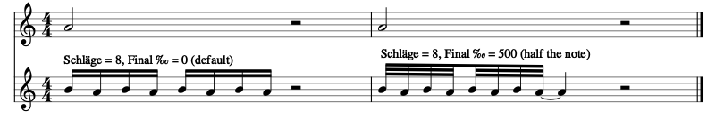
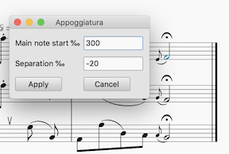
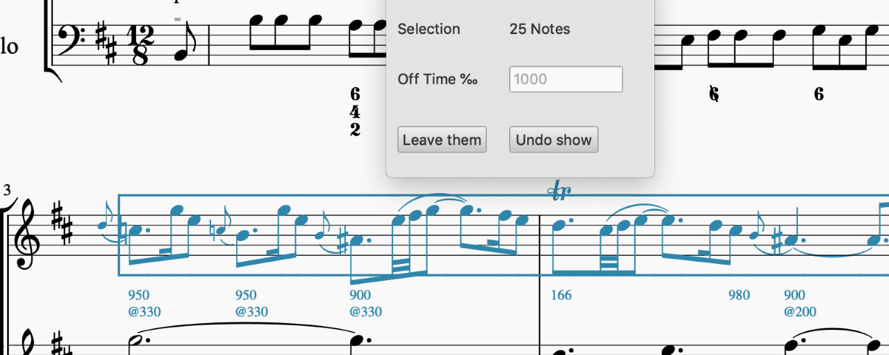

* **18 May 2020** **appoggiatura.qml 3.2** upgrades the appoggiatura plugin similarly (see **16 May 2020**) so that it no longer gratuitously takes down **DockArticulate** or any other dock plugins.

* **16 May 2020** **triller.qml 3.6** uses a different Qt technique to implement its modal dialog, which causes it not to take down the nonmodal dialogs of docking plugins such as **DockArticulate.qml**.  All MuseScore modal dialog plugins should do the same. Thanks to Rémi Marche (Marr11317@github) for discovering/advising this technique (use of QtQuick.Dialog) (https://doc.qt.io/qt-5/qml-qtquick-dialogs-dialog.html).

* **20 Jan 2020**   added,explaining a non-obvious technique (how to do ”turns” with the triller plugin).

* **15 Jan 2020**
**triller.qml 3.5** Reports the actual enharmonically-correct note names (in parentheses) for *Halbton* & *Ton*, in every case. That is, if the note is C#, a semitone below is B#; a semitone above is D, and a tone above is D#.  Or if the note is Ab, a semitone below is G, and above Bbb, etc. The *Unten*, clicked note, and *Oben* will always have three successive note-names (scale degrees).

* **14 Jan 2020**
**triller.qml 3.4** Fixes a bug in 3.3 (not clearing "kein" checkbox).  Cleans up 3.3 code, adds improved recognition of MuseScore trills.  The default of "8" *Schläge* (number of beats) is removed.  The new rule: if the note selected has ornamentation, and the plugin understands the ornamenation (which should include all unmodified ornamentation it creates, now or in the past, as well as MS trills), the *Schläge* field, like all, will be preloaded with what is seen on the note.  If the note lacks ornamentation, or the ornamentation is not understood, the field will be cleared, and must be supplied by you. That is, its content or emptiness can be interpreted as an indicator as to whether the note already has ornamentation. Thus, there is no longer a default.

* **13 Jan 2020**
**triller.qml 3.3** The plugin will now attempt to analyze the current ornamentation, if any, on the selected note, and initialize all of its dialog fields accordingly.  This should handle any ornamentation it can currently produce, as well as MuseScore-generated trills (trills starting on main note will not be special-cased; the plugin (other than with *Vorschläge*) always starts on the upper), as long as they haven’t been altered (e.g., with the Piano Roll editor). If it can’t decode the ornamentation, you’ll see the default values you would have prior to this enhancement.

* **23 Dec 2019**
**triller.qml 3.2** Adds a “trailing step” capability; that is, when nonzero **Final ‰** is specified (zero is the default), the trill is squeezed into the beginning of the note, i.e., the length of the note *minus that*.  The specified per-millage will be given to the sounding of the main note, with the last trill alternation tied to it.  This is a very common effect in authentic performance, and covers the case of “short trills”. An example should suffice:

Also, the default **Schläge** of 8 actually works; if no other value is put there, 8 trill beats will be authored.

* **5 Dec 2019**  Renamed myself from BernardSGreenberg to BernardGreenberg, as originally intended (deleted ancient unused work-associated account holding that name, moving internal links (and the MuseScore pointers). Thanks GitHub Developer Support for the mantras.

* **31 Oct 2019**  Noted official release of 3.3 as standard MuseScore, in several documents here and on site.

* **5 Oct 2019**
* **DockArticulate.qml 3.5** improve 3.4 to clear display when single-click on blank space (patch around complex misbehavior of new MS core code to support this).  Document "articulation browse mode" usage trick (no new functionality involved).

* **4 Oct 2019**
* **DockArticulate.qml 3.4** clears the display reliably when a non-note is clicked on.

* **3 Oct 2019**
* **rednote.qml version 3.2** changes its internal workings not to call **Qt.Quit()**, whose effect (when called) was to close down the MuseScore plugin engine, which undesirably closes open dock-type plugins such as **DockArticulate**, i.e., to close an open **DockArticulate** UI when a note was reddened with **rednote**.  Dialog-type plugins (**appoggiatura** and **triller**, as well as unrelated ones such as **TempoChanges**) will continue to close dock-type plugins when they are closed until a better solution can be designed and implemented (possibly MuseScore Core changes).

* **2 Oct 2019**
* **DockArticulate.qml** version 3.3 is a new, additional, plugin which implements the functionality of **articulate.qml** as a "dock plugin", that is, constantly visible (if wanted) and responding to user selection of notes and ranges automatically.  This allows viewing of note articulation parameters without any user action at all, and editing in a way almost identical to that in the inspector.  See .

* **6 Sept 2019**

* **rednote.qml** version 3.1 moves the plugin from the "Notes" sub-menu of "Plugins" to the latter's top-level.  There seems to be a bug in Qt/MS such that plugins at other than the top level, activated by shortcuts, sometimes fail to be activated from those shortcuts, and the problem is mysteriously "solved" by switching away from the MuseScore app and switching back and issuing the shortcut again.  Although the problem's root remains mysterious, this change improves the plugin's reliability.

* **3 Sept 2019**

* **appoggiatura.qml** version 3.1 introduces the ability to specify nonzero separation (or overlap) between the end of the appoggiatura (or *appoggiature*) and the start of the main note. This had previously been constrained to be zero, which is how it is created by MuseScore.  The first text field has been renamed from *perMille* to *Main note start ‰*.  The second text field, *Separation ‰*, is the positive separation between the end of the *appoggiatura(e)* and the start of the main note.  In almost all cases, leave it as zero. \
\
But with experience and skill, and varying criteria for different instruments and sound fonts, you can use negative values (try -20, -40, -50, whatever pleases you in each case) to create overlap, simulating enhanced legato between the *appoggiature* and the main note, when desired.  The effect is variably audible, subtle, and very pleasing when sufficiently finessed for voices and string instruments.

* **4 Aug 2019**

Added  describing issues with MuseScore representation of tied notes, issues that users need understand.

* **1 Aug 2019**

* **articulate.qml 3.2** fixes a bug in 3.1 that would create an unreadable score if you stored the annotations into it, say, if you were perhaps writing a phrasing tutorial .... 

* **articulate.qml** version 3.1 introduces a new feature which inserts on-time/off-time annotations as staff text under all notes in a selection for which either differs from the normal 0 and 1000. Select a region, invoke the plugin, and the "Show in score" button will appear along with the others. Press it to insert the numbers into the score.  You can do a whole score at once, if you wish.  There is an undo button in the dialog, which appears when the numbers are up, which will undo them all, or, alternatively, you can just leave them there for illustration, or undo them the usual way (Ctrl-Z/Command-Z). Each annotation can be selected and deleted like any other staff text.  Once you press "Show in score", you can only cancel (relabelled "Leave them") without removing the numbers, or press "Undo show", which also exits, but undoes the numbers first.

