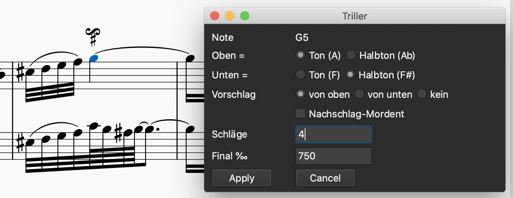

**20 January 2020**

**Turns with the triller plugin** (Or “one good turn deserves another”)

The triller plugin can be used to create carefully-timed “turns” and “inverted turns”, although some care is required.  “Right” and “inverted” turns are, happily, the *Vorschlag von unten* and *Vorschlag von oben* of the plugin, with no trill-beats remaining.   Below is an example (the note marked with that ornament) and the plugin parameters that produce the effect on the second staff.  The “Final” of 750 cuts out three quarters of the quarter-note, that is, three sixteenth-notes, leaving one sixteenth-note to be ornamented. Four *Schläge* (beats) covers the turn, and the final note of 750 extends the last beat, as always with the Triller plugin. When doing this, make sure you hear what you want.

The graphics and tie were added in the following way.  First, the quarter-note was placed.  Then the “turn” ornament was added from the “Ornaments”palette; do not silence it by turning off “Play” (its realization will be overwritten, and this is buggy in some versions of MuseScore).  Then the plugin was used to create this ornamentation, and, finally, the tie applied to it to link to the G in the next measure.

The small sharp under the turn graphic can be added as a “Symbol”, or even a Staff Text; its autoplace attribute must be checked off.

