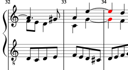

# Adjusting tied notes

BSG 3 Aug 2019

MuseScore's representation of the articulation parameters (on-time, off-time) for tied notes is currently obscure in a way you must understand if you wish to adjust the same.  The situation may improve in the future in such a way that will allow these plugins to act in a more consistent fashion.

For this explanation, we will use the MuseScore *staccato* dot, which can be applied to a note by typing Shift-S, as a means of applying "off-time 500" to a note accurately.  That is exactly what it does, as can be verified in the Piano Roll Editor (PRE).

The nature of electromagnetism is such that if you were to split a bar magnet in half, you do **not** get two "magnetic monopoles", a North one and a South one, but two bipolar magnets, a most unexpected result absent study of electromagnetism.  The same is true here.  Let us produce a little bar magnet: Set quarter-note = 40 and turn on the metronome. Enter two quarter-notes, tie them, click on the first, and type capital S to apply *staccato*.  Now play it!

What? Three-quarters of the note, not half of it? What's going on?  Use the **articulate** plugin, not the PRE, to look at the off-times of both notes.  You will see that the **first** one shows 500 and the second, 1000, the opposite of what you hear, and not what you expected anyway! Had you used the PRE to adjust the off-time of the *entire note*, you will see that it won't really do what you asked, but will adjust, visually, and set up to play the *second* note shortened, while (falsely) claiming that it applied the adjustment to the *entire note*.

If you now *untie* the two notes, forthwith the *first note* will obey the *staccato* you gave it, and the second will spring back to full value!  A split bar magnet!

Now try another experiment.  Make two more adjacent quarter notes, not tied, of the same pitch, and add *staccato* to the *second* one. Play it, and it will, of course, play as expected. If you view it in the PRE, however, you will not even see the change -- this is a bug. But it plays as expected again, with the second cut back. The magnetic monopole! Much better?

So where do the articulation parameters belong for a tied note? MuseScore isn't really sure, because it seems to be prepared for your doing the second experiment, putting them on the last note, which produces the "right" answer.  But putting them in the first note works, too, until you untie the notes (and if you call truncating the final note when you asked to edit the first note "working"), and the one the PRE respects.  MuseScore seems to handle either model, and can't ever stop handling either model, lest scores with articulations on final notes of tied groups (of which I have authored many over the years) to play properly.

MuseScore does not handle this consistently, and supports enough variability in extant scores that it may never.

So, when using the **articulate** plugin, to which part of a tied note should it be applied?  My practice has been "it depends upon how it ends", i.e., if the ending of the tied note is a suspension that has to end simultaneously with another voice, I set the articulation parameters on the last note, as here.  This has the advantage of letting you select both notes at once and set the off-time in a "multiple" operation.

If the tie is just a rhythmic notation within a measure, as here, I click on and change the first note.  The effect, in either case, is **identical**, i.e., to apply the changes to the *last* note, no matter in which they are "stored."

