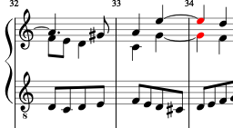
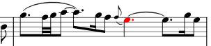

# Adjusting tied notes

BSG 3 Aug 2019

MuseScore's representation of the articulation parameters (on-time, off-time) for tied notes is currently very ... "surprising", in a way you have to know about if you wish to set the articulation parameters of such notes.  It may improve in the future in such a way that will allow these plugins to act in a more consistent fashion.

The nature of electromagnetism is such that if you were to split a bar magnet in half, you do **not** get two "magnetic monopoles", a North one and a South one, but two bipolar magnets, a most unexpected result absent study of electromagnetism.  The same is true here.  Let us produce a little bar magnet: Set quarter-note = 40 and turn on the metronome. Enter two quarter-notes, tie them, and then enter the Piano Roll Editor (from the right click menu on the blue-boxed measure).  Then click on the yellow bar for that note, and reduce the length you see from 1000 to 500, and play it back.

What? Three-quarters of the note, not half of it? What's going on?  Go back to the main window, and use the articulate plugin to look at the off-times of both notes.  You will see that the **first** one shows 500 and the second, 1000, the opposite of what you hear, and not what you expected anyway!   The piano roll editor, acting for MuseScore, has stored the articulation parameters for the tied chain, in fact, those for the second note, in the first!

Well, if that's what it wants to do, fair enough. But then remove the tie, and play.  The first note will play back cut to 500, and the second will play full!  How about that? The split bar magnet!

Now try another experiment.  Make two more adjacent quarter notes, not tied, of the same pitch, and in the piano roll editor, cut back the second one.  Play it, and it will, of course, play as expected. Now go back to the main window and tie them.  And it plays as expected again, with the second cut back. The magnetic monopole! Much better?

So where do the articulation parameters belong for a tied note? MuseScore isn't really sure, because it seems to be prepared for your doing the second experiment, putting them on the last note, which produces the "right" answer.  But putting them in the first note works, too, until you untie the notes (and if you call truncating the final note when you asked to edit the first note "working").  MuseScore seems to handle either model, and can't ever stop handling either model, lest scores with piano-roll editing of notes later joined or unjoined fail to play properly.

MuseScore does not handle this consistently, and supports enough variability in extant scores that it may never.

So, when using the articulation plugin, to which part of a tied note should it be applied?  My practice has been "it depends upon how it ends", i.e., if the ending of the tied note is a suspension that has to end simultaneously with another voice, I set the articulation parameters on the last note, as here.  This has the advantage of letting you select both notes at once and set the off-time in a "multiple" operation.

If the tie is just a rhythmic notation within a measure, as here, I click on and change the first note.  The effect, in either case, is **identical**, i.e., to apply the changes to the *last* note, no matter in which they are "stored."

